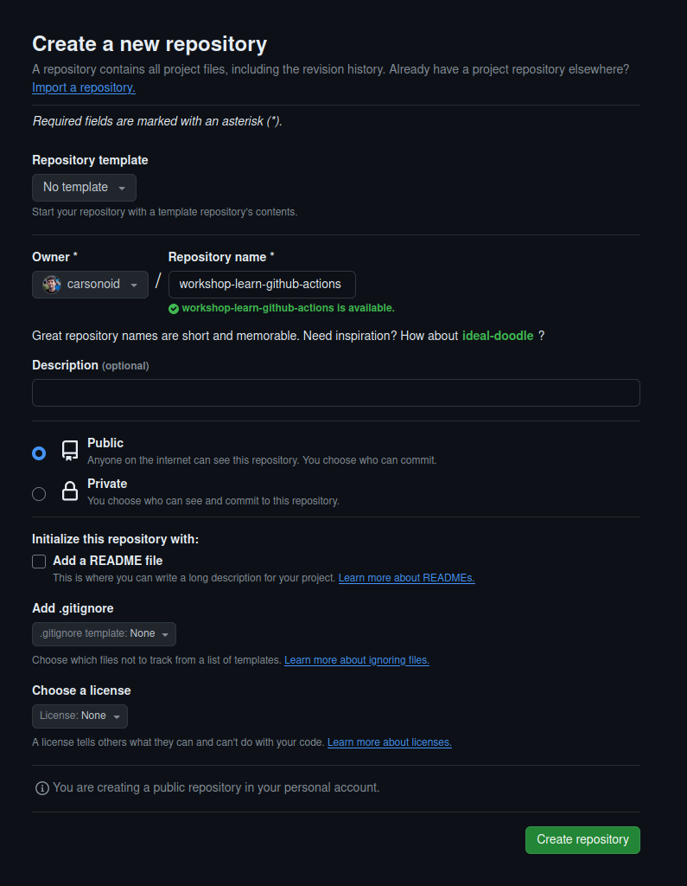

# Create the Repository

First, you will need to create a new repository on GitHub. This repository will be used to store the code for the workshop and will
be the repository which will run all the GitHub Actions and Workflows.

We are going to make a new repository using the GitHub web interface.

## Instructions

Open up the [New Repository Page](https://github.com/new) and fill it out with these suggested settings:

* Template: `No Template`
* Owner: `Your GitHub User`
* Name: `workshop-learn-github-actions`
  * This can be the same for everyone since it is namespaced under your user
* Visibility: `Public`
  * GitHub Actions are availabile to *both* public and private repositories, Each repository gets a number of free "minutes" of action time per month.
  * But, we will be using GitHub Pages to serve the static assets, which will require the repository to be public.

Everything else can be left unchecked. We will be bootstraping the contents of the repo in a later step





## Bootstrap The Repository Contents

1. Open the respository in GitHub
2. Click "Create a codespace"
3. Click "Create new codespace"
4. Use the terminal to download and extract the assets for the workshop
    ```
    curl  | tar -zxv
    ```
    * Alternatively, you can [download the assets]() then right click in the file explorer and choose "Upload File", then run `tar -zxvf workshop-assets.tgz`



## Run the site live

The default codespace image actually comes with `hugo` pre-installed! So you can easily view the site live

```bash
hugo server
```

```txt
@carsonoid ➜ /workspaces/workshop-learn-github-actions (main) $ hugo server
Watching for changes in /workspaces/workshop-learn-github-actions/{content,data,layouts,static,themes}
Watching for config changes in /workspaces/workshop-learn-github-actions/config.toml
Start building sites … 
hugo v0.124.1-db083b05f16c945fec04f745f0ca8640560cf1ec linux/amd64 BuildDate=2024-03-20T11:40:10Z VendorInfo=gohugoio


                   | EN  
-------------------+-----
  Pages            | 18  
  Paginator pages  |  0  
  Non-page files   |  3  
  Static files     | 78  
  Processed images |  0  
  Aliases          |  2  
  Cleaned          |  0  

Built in 52 ms
Environment: "development"
Serving pages from disk
Running in Fast Render Mode. For full rebuilds on change: hugo server --disableFastRender
Web Server is available at //localhost:1313/ (bind address 127.0.0.1) 
Press Ctrl+C to stop
```

> You can even view the site by selecting "open in browser" when codespace pops up.



## Build the site

The default codespace image actually comes with `hugo` pre-installed! So you can easily test that the bootstrapped site builds by just running `hugo` which builds by default

```bash
hugo
```

```txt
@carsonoid ➜ /workspaces/workshop-learn-github-actions (main) $ hugo
Start building sites … 
hugo v0.124.1-db083b05f16c945fec04f745f0ca8640560cf1ec linux/amd64 BuildDate=2024-03-20T11:40:10Z VendorInfo=gohugoio


                   | EN  
-------------------+-----
  Pages            | 18  
  Paginator pages  |  0  
  Non-page files   |  3  
  Static files     | 78  
  Processed images |  0  
  Aliases          |  2  
  Cleaned          |  0  

Total in 101 ms
```

Success! Now we have a `public` directory inside the codespace that contains all the static web assets needed to serve our site.


