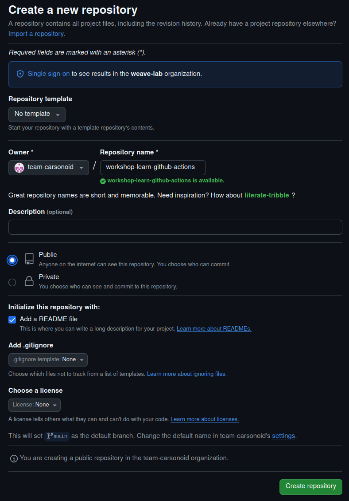
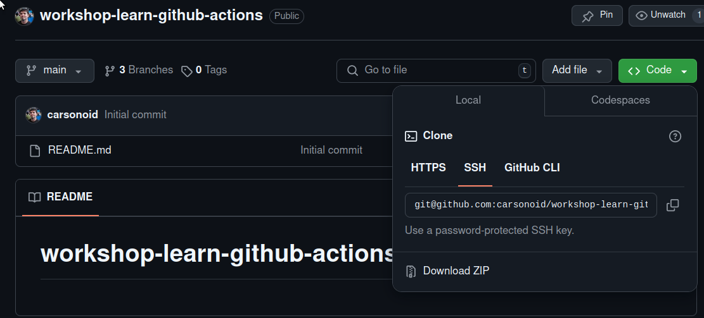
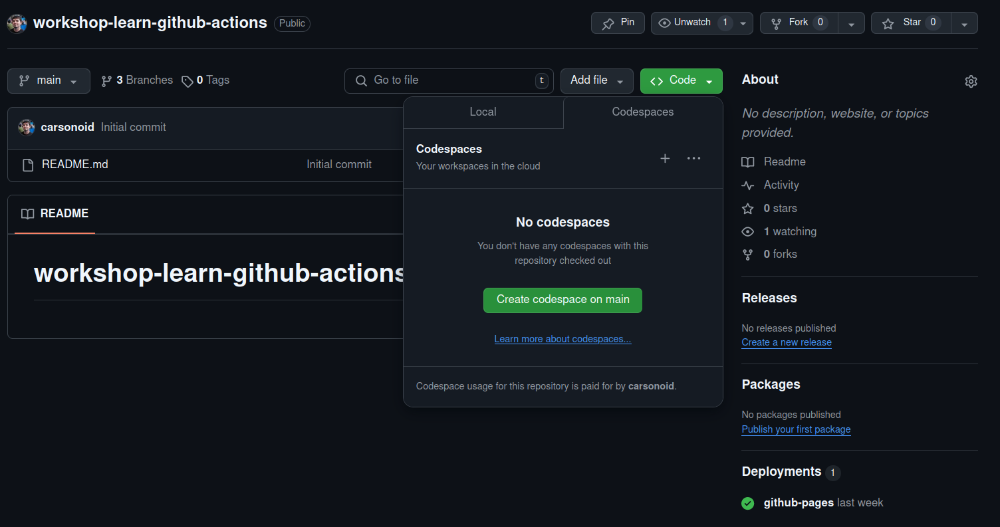
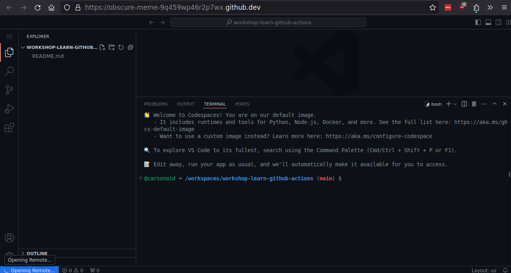

# Create the Repository





<--->

First, you will need to create a new repository on GitHub. This repository will be used to store the code for the workshop and will
be the repository which will run all the GitHub Actions and Workflows.

We are going to make a new repository using the GitHub web interface.




## Instructions


Open up the [New Repository Page](https://github.com/new) and fill it out with these suggested settings:

* Template: `No Template`
* Owner: `Your GitHub User`
* Name: `workshop-learn-github-actions`
  * This can be the same for everyone since it is namespaced under your user
* Visibility: `Public`
  * GitHub Actions are availabile to *both* public and private repositories, Each repository gets a number of free "minutes" of action time per month.
  * But, we will be using GitHub Pages to serve the static assets, which will require the repository to be public.

Everything else can be left unchecked. We will be bootstraping the contents of the repo in a later step





## Bootstrap The Repository Contents


1. Open the respository in GitHub
2. Click the `Code` button
  
1. Click the "Codespaces tab"
2. Click "Create codespace on main"
  
3. Wait for the page to load

5. Use the terminal to download and extract the assets for the workshop
    ```bash
    curl  | tar -zxv
    ```
    * Alternatively, you can [click here download the assets]() then right click in the file explorer and choose "Upload", then run `tar -zxvf workshop-assets.tgz`



## Run the site live


The default codespace image comes with `hugo` pre-installed, but it does not have some features required by this site, so we need to install the extended edition:

```bash
curl -L https://github.com/gohugoio/hugo/releases/download/v0.134.3/hugo_extended_0.145.0_linux-amd64.tar.gz | tar -zxv hugo
```

Then run the version we installed:

```bash
./hugo server
```

```txt
@carsonoid ➜ /workspaces/workshop-learn-github-actions (main) $ hugo server
Watching for changes in /workspaces/workshop-learn-github-actions/{content,data,layouts,static,themes}
Watching for config changes in /workspaces/workshop-learn-github-actions/config.toml
Start building sites … 
hugo v0.124.1-db083b05f16c945fec04f745f0ca8640560cf1ec linux/amd64 BuildDate=2024-03-20T11:40:10Z VendorInfo=gohugoio


                   | EN  
-------------------+-----
  Pages            | 18  
  Paginator pages  |  0  
  Non-page files   |  3  
  Static files     | 78  
  Processed images |  0  
  Aliases          |  2  
  Cleaned          |  0  

Built in 52 ms
Environment: "development"
Serving pages from disk
Running in Fast Render Mode. For full rebuilds on change: hugo server --disableFastRender
Web Server is available at //localhost:1313/ (bind address 127.0.0.1) 
Press Ctrl+C to stop
```

> You can even view the site by selecting "open in browser" when codespace pops up.



## Build the site


Runing `hugo server` builds the site for local viewing, but it does not build production-ready assets. To do that, simply run `hugo` without any arguments.

```bash
./hugo
```

```txt
@carsonoid ➜ /workspaces/workshop-learn-github-actions (main) $ hugo
Start building sites … 
hugo v0.124.1-db083b05f16c945fec04f745f0ca8640560cf1ec linux/amd64 BuildDate=2024-03-20T11:40:10Z VendorInfo=gohugoio


                   | EN  
-------------------+-----
  Pages            | 18  
  Paginator pages  |  0  
  Non-page files   |  3  
  Static files     | 78  
  Processed images |  0  
  Aliases          |  2  
  Cleaned          |  0  

Total in 101 ms
```

Success! Now we have a `public` directory inside the codespace that contains all the static web assets needed to serve our site.


