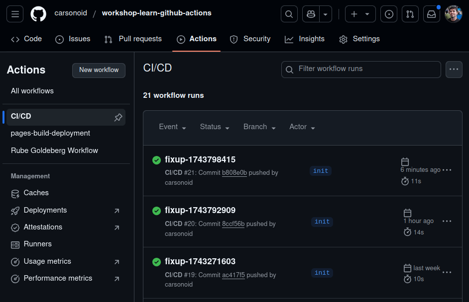

# First Workflow





<--->

Once you have the bootstrapped repository and workshop content from the [Create Repo Page]() you are ready
to create your first GitHub Actions Workflow!

The general overview of this workflow:

* Run on push to the repository
* Contains a single job which should
  * Clone the repo
  * Install `hugo`
  * Build the site
  * (sometimes) Publish the site to GitHub Pages


There are many, many more fields that are valid for workflows, jobs, and steps then we will
cover here. [See the docs for all the options](https://docs.github.com/en/actions/writing-workflows/workflow-syntax-for-github-actions)





## Create the workflow


Defining a workflow with GitHub actions is easy as making a file! Do the following
inside your code space:

```bash
mkdir -p .github/workflows
touch .github/workflows/cicd.yaml
```

Or

Right Click in the explorer and click "New File" and type `.github/workflows/cicd.yaml`


**The folder names matter**

The file name for a workflow file can by anything. But it *must* be in a directory at the root of the repo
that exactly matches the name `.github/workflows` for the file to be discovered.





## Setup the workflow name and trigger


Here is the start to our new workflow:

```yaml
name: CI/CD

on: push
```

---

* The [name field](https://docs.github.com/en/actions/writing-workflows/workflow-syntax-for-github-actions#name) is optional and can be whatever you want. But it will be used in the GitHub UI in many places so a short human-friendly name is best.
* The [on field](https://docs.github.com/en/actions/writing-workflows/workflow-syntax-for-github-actions#on) is where you define the conditions under which your workflow runs.
  * We will just use `on: push` to have the workflow trigger whenver *any* commits or tags are pushed.
* The `jobs` field is where all jobs are defined, it is empty for now but we will add the first job in the next step



## Setup the build job


```yaml
name: CI/CD

on: push

jobs:
  build-site:
    name: Build Site
    runs-on: ubuntu-20.04
    permissions:
      contents: write
    steps: # TODO:
```

---

The `jobs` field of the workflow is a `map` of job ids to job descriptions. We have
defined a single job with the `id` of `build`

* The [name](https://docs.github.com/en/actions/writing-workflows/workflow-syntax-for-github-actions#jobsjob_idname) field is used to give our job a more human-readable name
* The [runs-on](https://docs.github.com/en/actions/writing-workflows/workflow-syntax-for-github-actions#jobsjob_idruns-on) field is required. It tells the actions information
  about the kind of runner the job needs.
    * We are using `ubuntu-20.04` which is a [GitHub Hosted Runner](https://docs.github.com/en/actions/writing-workflows/workflow-syntax-for-github-actions). There are many other kinds of runner, including custom runners (not covered in this workshop)
* The [permissions](https://docs.github.com/en/actions/writing-workflows/workflow-syntax-for-github-actions#permissions) field defines custom permissions this workflow will need on our repo.
  * This field is optional and the default is normally only `contents: write`. This workflow is going to need to push the static site content to a branch of the repository, so we need to give it extra permissions.
* The `steps` field is empty for now, but we will put all our job steps there in the next section.



## Add the checkout step


```yaml
name: CI/CD

on: push

jobs:
  build-site:
    name: Build Site
    runs-on: ubuntu-20.04
    permissions:
      contents: write
    steps:
      - name: Checkout
        uses: actions/checkout@v3
        with:
          submodules: true
          fetch-depth: 0

```

---

Remember: Each job starts with an empty workspace. So, if we want to build
our static web site from the workshop code, we need to first clone the repository
from GitHub.

We can do this with the `actions/checkout` action which is an offical action [provided and maintained by GitHub directly](https://github.com/actions/checkout).

Things to note about this action:

1. It references a github repository by name using the `uses` field
   1. It is pinned to a specific tag in the  by using the `@` sign in the action names. This is required, GitHub actions does not have an automatic "latest" tag for actions. (this is a good thing!)
2. TODO HERE



## Add the hugo install step


```yaml
name: CI/CD

on: push

jobs:
  build-site:
    name: Build Site
    runs-on: ubuntu-20.04
    permissions:
      contents: write
    steps:
      - name: Checkout
        uses: actions/checkout@v3
        with:
          submodules: true
          fetch-depth: 0

      - name: Setup Hugo
        uses: peaceiris/actions-hugo@v3
        with:
          hugo-version: 'latest'
          extended: true
```



## Add the build step


```yaml
name: CI/CD

on: push

jobs:
  build-site:
    name: Build Site
    runs-on: ubuntu-20.04
    permissions:
      contents: write
    steps:
      - name: Checkout
        uses: actions/checkout@v3
        with:
          submodules: true
          fetch-depth: 0

      - name: Setup Hugo
        uses: peaceiris/actions-hugo@v3
        with:
          hugo-version: 'latest'
          extended: true

      - name: Build
        run: |
          # there is no built-in env variable for the repo name without owner, so we have to parse it out
          REPO_NAME=$(echo "${GITHUB_REPOSITORY}" | cut -d'/' -f2)
          hugo --minify -b "https://${GITHUB_REPOSITORY_OWNER}.github.io/$REPO_NAME/"
```



## Add the deploy step


```yaml
name: CI/CD

on: push

jobs:
  build-site:
    name: Build Site
    runs-on: ubuntu-20.04
    permissions:
      contents: write
    steps:
      - name: Checkout
        uses: actions/checkout@v3
        with:
          submodules: true
          fetch-depth: 0

      - name: Setup Hugo
        uses: peaceiris/actions-hugo@v3
        with:
          hugo-version: 'latest'
          extended: true

      - name: Build
        run: |
          # there is no built-in env variable for the repo name without owner, so we have to parse it out
          REPO_NAME=$(echo "${GITHUB_REPOSITORY}" | cut -d'/' -f2)
          hugo --minify -b "https://${GITHUB_REPOSITORY_OWNER}.github.io/$REPO_NAME/"

      - name: Deploy
        if: github.ref == 'refs/heads/main' or github.ref == 'refs/heads/init'
        uses: peaceiris/actions-gh-pages@v3
        with:
          github_token: ${{ secrets.GITHUB_TOKEN }}
          publish_dir: ./public
```



## Full Final Workflow


```yaml
name: CI/CD

on: push

jobs:
  build-site:
    name: Build Site
    runs-on: ubuntu-20.04
    permissions:
      contents: write
    steps:
      - name: Checkout
        uses: actions/checkout@v3
        with:
          submodules: true
          fetch-depth: 0

      - name: Setup Hugo
        uses: peaceiris/actions-hugo@v3
        with:
          hugo-version: 'latest'
          extended: true

      - name: Build
        run: |
          # there is no built-in env variable for the repo name without owner, so we have to parse it out
          REPO_NAME=$(echo "${GITHUB_REPOSITORY}" | cut -d'/' -f2)
          hugo --minify -b "https://${GITHUB_REPOSITORY_OWNER}.github.io/$REPO_NAME/"

      - name: Deploy
        if: github.ref == 'refs/heads/main' or github.ref == 'refs/heads/init'
        uses: peaceiris/actions-gh-pages@v3
        with:
          github_token: ${{ secrets.GITHUB_TOKEN }}
          publish_dir: ./public
```




## Now run it!


Because our workflow is set up to trigger on `push` all we have to do to kick it off
is to simply create a new commit and `push` it to GitHub.

```shell
git checkout -b init
git add .
git commit -m "feat: initial add"
git push -u origin HEAD
```

Ok... now what? We pushed the update but how do we know if it is working?



## Watching a workflow



Luckily, GitHub provides a very useful UI to help us track workflows and check
the status of the jobs. It can be found under the `Actions` tab on the repository's
GitHub page.




